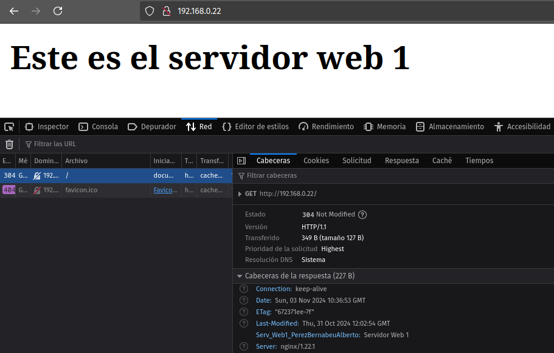
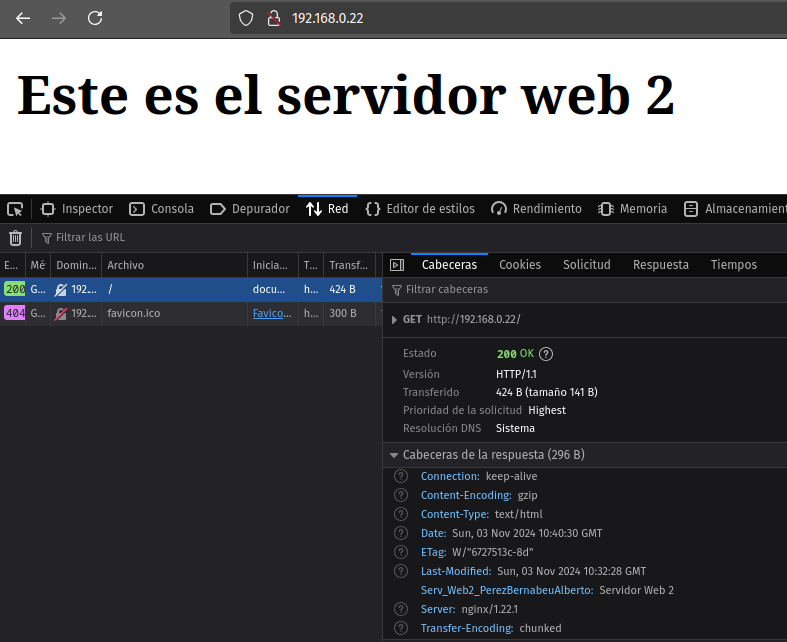

# Práctica 2-4. Balanceo de carga

Para realizar esta tarea es necesario clonar la MV que funciona como servidor web. 
De esta manera, tendremos dos servidores web y un servidor que funciona como proxy 
inverso y balanceador de carga.

Un recordatorio de las IPs que se están utilizando en cada máquina: 
<ul>
	<li><b>Anfitriona:</b> 192.168.0.13</li>
	<li><b>Servidor web 1:</b> 192.168.0.20</li>
	<li><b>Servidor web 2:</b> 192.168.0.21</li>
	<li><b>Servidor proxy:</b> 192.168.0.22</li>
</ul>

## Configuración del primer servidor web

Será necesario cambiar el nombre del directorio que contiene los archivos 
del servidor web a webserver1. Lo mismo con el archivo de configuración y 
con el enlace simbólico, en los directorios /etc/nginx/sites-available y 
/etc/nginx/sites-enabled.

Además, se le añade una cabecera al archivo de configuración. En mi caso:
```console
location /{
	add-header Serv_Web1_PerezBernabeuAlberto "Servidor Web 1";
}
```

También he modificado el contenido del HTML del servidor, para que muestre:
```html
<html>
	<head>
		<title> Prueba de balanceo con NGINX</title>
	</head>
	<body>
		<h2>Este es el servidor web 1</h2>
	</body>
</html>
```


## Configuración del segundo servidor web

La configuración del segundo servidor es la misma que la del primer servidor web, 
cambiando "webserver1" por "webserver2" en los lugares que es necesario.


## Configuración del servidor proxy inverso

En el servidor proxy inverso, para configurar el balanceo de carga, 
modificamos el archivo de configuración de /etc/nginx/sites-available/ de 
la siguiente manera: 
```console
upstream backend_hosts {
	random;
	server 192.168.0.20:8080;
	server 192.168.0.21:8080;
}

server {
	listen 80;
	listen [::]:80;
	server_name webserver www.webserver.com;
	location / {
		proxy_pass http://backend_hosts;
		# add_header Host proxy_inverso_albertoperez;
	}
}
```

Así, cuando desde la máquina anfitriona busquemos 192.168.0.22:80 (o la IP correspondiente al servidor 
o el nombre que le hayamos dado desde el archivo /etc/hosts de la anfitriona) recibiremos realmente 
el contenido de uno de los servidores web, en este caso, aleatoriamente.





Podemos observar que en ambos casos, efectivamente, se ha buscado la IP del servidor proxy, pero en un 
caso se ha devuelto el contenido del servidor web 1 y su cabecera correspondiente y en el otro caso se 
ha devuelto el contenido del servidor web 2 y su cabecera correspondiente.

Si paramos el servicio de Nginx en uno de los servidores web, sólo se mostrará el contenido del otro 
servidor. Lo mismo ocurrirá si por una causa ajena uno de los servidores web cae o es inutilizado.

## Apunte sobre solución de problemas

Al trabajar con varias máquinas al mismo tiempo, hay que tener en cuenta que existen muchos errores que 
pueden ocurrir y es necesario saber cómo diagnosticar qué está fallando cuando no obtememos el resultado 
que esperamos. 

En mi caso, a mitad de realizar esta práctica, tenía configurados correctamente los servidores web y el servidor proxy, pero al acceder a la IP de 
éste desde el navegador de mi máquina anfitriona, no accedía al contenido. La manera de proceder para 
diagnosticar el problema fue el siguiente:

<ol>
	<li>
		<b>Comprobar que existe comunicación entre los servidores web y el proxy inverso</b><br>
		Para ello, podemos utilizar <b>curl</b> y <b>ping</b> desde el proxy:
```console
curl 192.168.0.20:8080
curl 192.168.0.21:8080

ping 192.168.0.20
ping 192.168.0.21
```
		En mi caso particular, con ping comprobé que existía comunicación entre las máquinas, pero curl no devolvía 
		correctamente el servicio alojado en los puertos de los servidores web.
	</li><br>
	<li>
		<b>Comprobar que existe una regla de cortafuegos para los puertos :8080 en los servidores web</b><br>
		Para ello, podemos utilizar la herramienta <b>ufw</b>:
```console
sudo ufw status			# Muestra las reglas existentes
sudo ufw allow 8080/tcp		# Crear la regla si no existe para que se permita la comunicación por el puerto :8080
```
		En mi caso no existía la regla para permitir la comunicación por los puertos :8080 de los servidores web. Una vez 
		creadas las reglas en cada servidor web, pude terminar la práctica correctamente.
	</li><br>
	<li>
		<b>Comprobar las configuraciones de cada servidor</b><br>
		Una vez hechas las comprobaciones pertinentes sobre las conexiones de los servidores, si existe algún problema, 
		es bastante probable que estos se encuentren en los archivos de configuración de /etc/nginx/sites-available de 
		alguno de los servidores. Podemos obtener indicaciones valiosas desde Nginx ejecutando:
```console
sudo nginx -t
```
</ol>


## Cuestiones finales


<b>1. Busca información de qué otros métodos de balanceo se pueden aplicar con Nginx y describe al menos 3 de ellos.</b>

Otros métodos de balanceo que permite Nginx son: 

- <b>least_conn:</b> el proxy enviará las solicitudes entrantes al servidor que tenga un menor número de conexiones activas en 
ese momento, para evitar las eventuales sobrecargas.

- <b>ip_hash:</b> se asigna cada solicitud a un servidor en función del hash de la dirección del cliente, de manera que todas 
las solicitudes de un mismo cliente serán dirigidas siempre al mismo servidor. En caso de que caiga el servidor, se enviará la 
petición al siguiente servidor en el grupo.

- <b>least_time:</b> la petición será enviada al servidor con menor latencia y menor cantidad de conexiones activas, es decir, 
el que ofrezca un menor tiempo de espera para la respuesta.

<b>2. Si quiero añadir 2 servidores web más al balanceo de carga, describe detalladamente qué configuración habría que añadir y dónde.</b>

Considerando que tuvieramos dos nuevos servidores con configuraciones correctas (contenido correcto y con permisos adecuados en /var/www, 
archivos de configuración en /etc/nginx/sites-available correctos y Nginx funcionando correctamente y sin problemas con los permisos del 
cortafuegos), sólo sería necesario indicar las IPs y puertos de los servidores en el archivo de configuración del proxy. Por ejemplo:
```console
upstream backend_hosts {
    server 192.168.0.20:8080;
    server 192.168.0.21:8080;	
    server 192.168.0.23:8080;	# Nuevo servidor
    server 192.168.0.24:8080;	# Nuevo servidor
}
```
En caso de error, sería necesario realizar las comprobaciones oportunas en los nuevos servidores web (que Nginx funcione correctamente en ellos 
y que exista conexión estable entre estos y el proxy)
